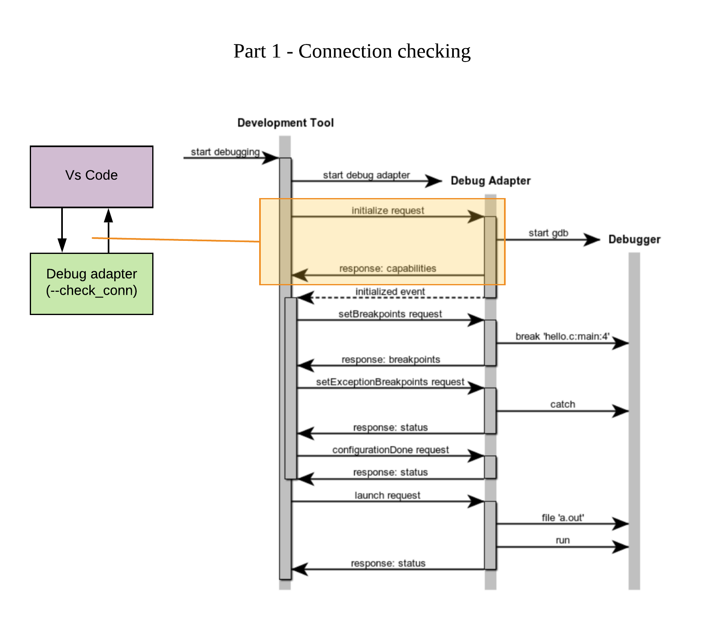
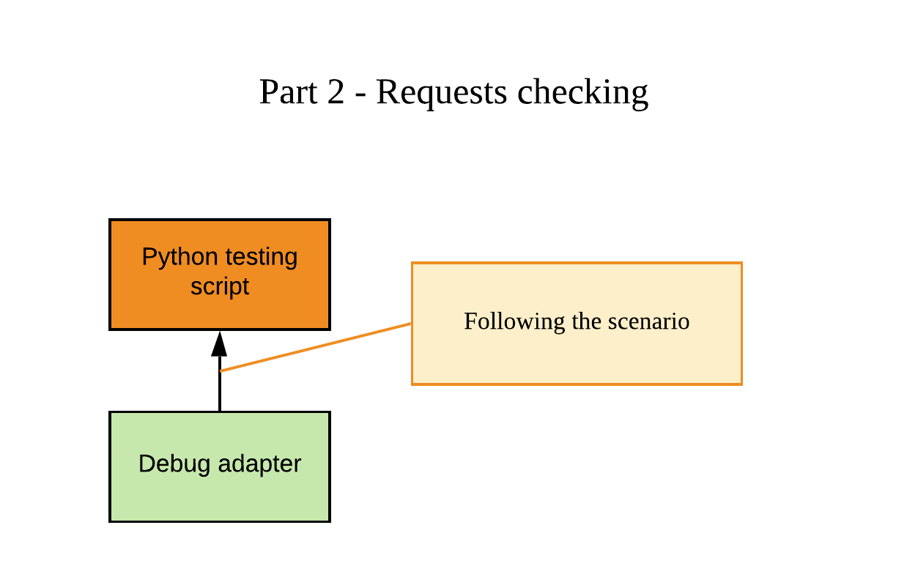
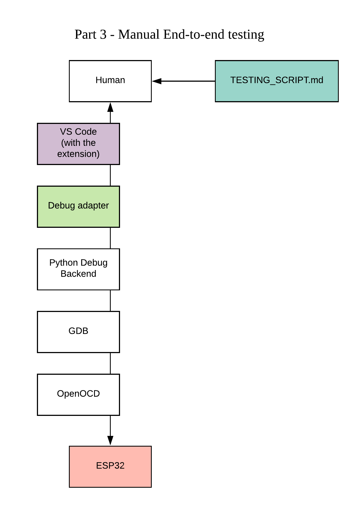

# Testing

## VSCode<->DebugAdapter Connection checking



## Testing scenarios

### Main idea



We have a working program working as a server (Debug Adapter in this case) and a client program that read json files with a specific structure (called scenarios), sends a specific data described in that files on input and expects output with some specific format also described.

Each scenario is a json file with following structure

``` json
{
    "name": "...",
    "previous": "...",
    "script": [
        ...
    ]
}
```

**name** - scenario's name

**previous** - name of scenario, considered to be launch previously ("" - if the fist one)

**script** - list of consiquenced DAP jsons which will sended ("request" types), and received ("response" and "event" types).

We are sending requests to Adapter input and waiting for appropriate response for each of them according to the scenario. If we read json of event type, we wait for the specific event, according to for the scenario without any request sent.

### Script field's jsons

Each request considers getting request. If the event was read - following the scenario we will wait for the event during some timeout.

Responses and events could have `__ANY__` content in their fields in the scenario. That's mean, during the testing we do not care about its value.

Example:

``` json
{
    "body": {
        "reason": "breakpoint",
        "description": "ANY",
        "allThreadsStopped": true,
        "threadId": 8
    },
    "type": "event",
    "event": "stopped",
    "seq": "ANY"
}
```

At the example, we are not interested in the field *seq* (because e.g. we don't know the specific number of the response) and *body.description* (because this information could be program specific, but we are waiting for program insensitive behavior).

## End-to-end testing

For that type of testing is used [TESTING_SCRIPT.md](https://gitlab.espressif.cn:6688/idf/vscode-plugin/blob/feature/debug-adapter-integration/TESTING_SCRIPT.md) from the vscode-plugin project

