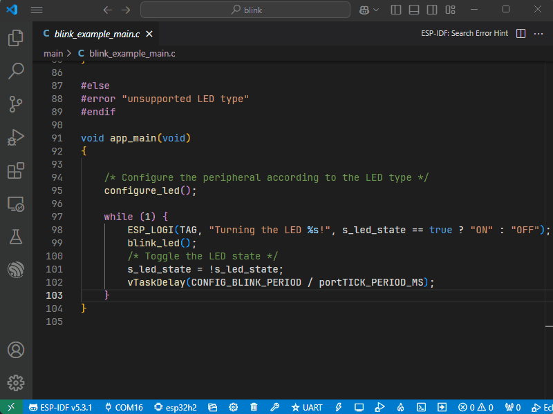
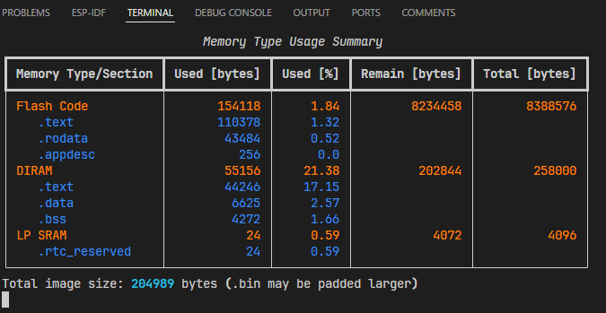

# Analyze Your Application Size

ESP-IDF Extension provides powerful tools to analyze your application's memory usage, helping you optimize storage allocation. You can visualize size information in two convenient ways:

## Visual Analysis
Get a detailed graphical breakdown of your application's memory usage:

1. Run the command "ESP-IDF: Size Analysis of the Binaries"
2. Press Enter to see a visual representation of memory usage

## CLI Analysis
View detailed size information in the terminal after each build:

1. Build your project using the Command "ESP-IDF: Build your Project"
2. The size analysis will automatically appear in the terminal after the build

## Resources
- [Application Size Analysis Documentation](https://docs.espressif.com/projects/vscode-esp-idf-extension/en/latest/additionalfeatures/application-size-analysis.html)