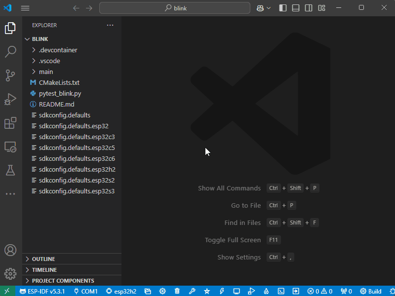
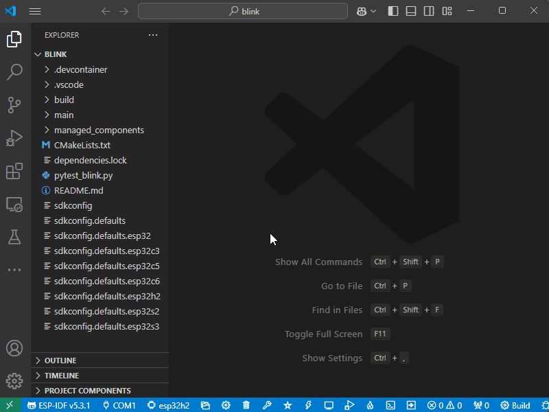

# Install ESP-IDF Components

### Browse and Install Components

### Create Projects from Examples

## Related Resources
- [Install ESP-IDF Components Documentation](https://docs.espressif.com/projects/vscode-esp-idf-extension/en/latest/additionalfeatures/install-esp-components.html)