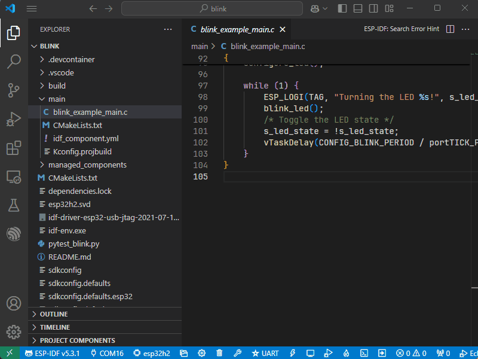

# Debug Your ESP Project

Debug ESP projects in VS Code with breakpoints, variable inspection, and more.

## Prerequisites

Before starting:
- Verify your board supports JTAG debugging
- Configure JTAG following the ESP-IDF documentation for your specific target
  > Navigate to the correct JTAG setup guide:
  > 1. Visit [ESP-IDF Programming Guide](https://docs.espressif.com/projects/esp-idf/en/latest/)
  > 2. Select your target (e.g., ESP32, ESP32-H2)
  > 3. Go to API Guides → JTAG Debugging -> Configuring `<YOUR TARGET>` Target

> 💡 **Windows Users**: Install required USB drivers via ESP-IDF Tools Installer v2.8+ or follow target-specific documentation.

## Setup Steps

1. Configure Debug Connection:
   - `ESP-IDF: Select Port to Use`
   - `ESP-IDF: Select OpenOCD Board Configuration`

2. Launch Debugger:
   - Press `F5` or use Run → Start Debugging
   - Program halts at entry point

## Debug Features

- Set breakpoints: Click line number margin
- Inspect variables: Use Watch window
- Navigation:
  - Step Over (F10)
  - Step Into (F11)

> 💡 **Note**: ESP32 is limited to 2 hardware breakpoints - use strategically!

For aditional debugging features, check out the [VS Code Extension Debug Guide](https://docs.espressif.com/projects/vscode-esp-idf-extension/en/latest/debugproject.html)

## Resources

- [VS Code Extension Debug Documentation](https://docs.espressif.com/projects/vscode-esp-idf-extension/en/latest/debugproject.html)
- [ESP-IDF Debug Documentation](https://docs.espressif.com/projects/esp-idf/en/latest/esp32/api-guides/jtag-debugging/index.html)