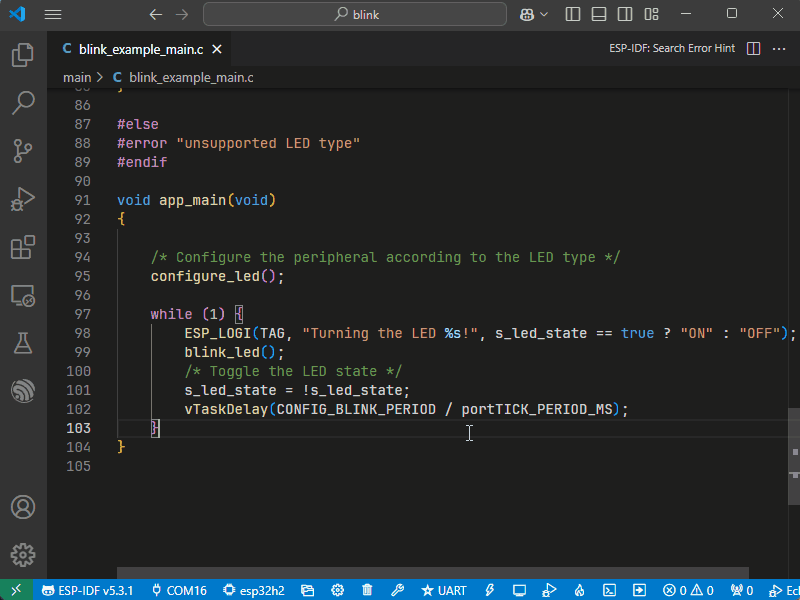

# Customize Your ESP32's Memory Layout with Partition Table Editor

## Related Resources
- [Partition Table Editor Documentation](https://docs.espressif.com/projects/vscode-esp-idf-extension/en/latest/additionalfeatures/partition-table-editor.html)
- [ESP-IDF Partition Tables documentation](https://docs.espressif.com/projects/esp-idf/en/latest/esp32/api-guides/partition-tables.html)