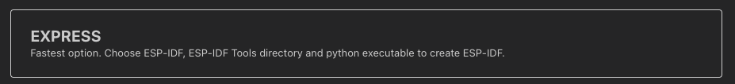
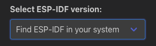
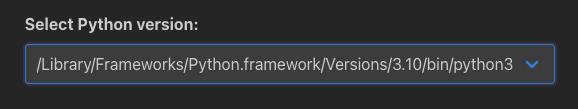
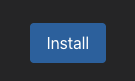

# Configure the ESP-IDF VS Code Extension

### 1. Select Setup Mode
Choose the Express setup mode (recommended).

### 2. Choose ESP-IDF Version
Expand dropdown menu and select an ESP-IDF version.

### 3. Set Python Path (macOS and Linux only)
Choose the appropriate Python path from the dropdown.

### 4. Install
Click the Install button to begin the installation process.

### 5. Post-Installation Step (Linux only)
For Linux users, a message is shown to add OpenOCD rules in `/etc/udev/rules.d` which you need to run with sudo privileges.

## Related Resources

In case you get stuck, you can always follow the in depth [Installation](https://docs.espressif.com/projects/vscode-esp-idf-extension/en/latest/installation.html) documentation.