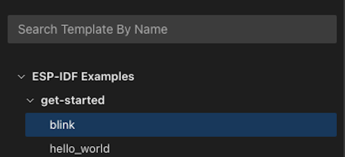

# Create a Project Using an ESP-IDF Example

### 1. Select an Example Project
Choose an example project from the list provided. For beginners, we recommend starting with the Blink example.

### 2. Create the Project
Click the "Create project using example blink" button to proceed.

After clicking the button, you'll be prompted to choose a location where the project will be created.

## Next Steps

Once you've created your project:
- Explore the project structure in VS Code
- Review the example code to understand its functionality
- Build and flash the project to your ESP device
- Modify the code to experiment and learn